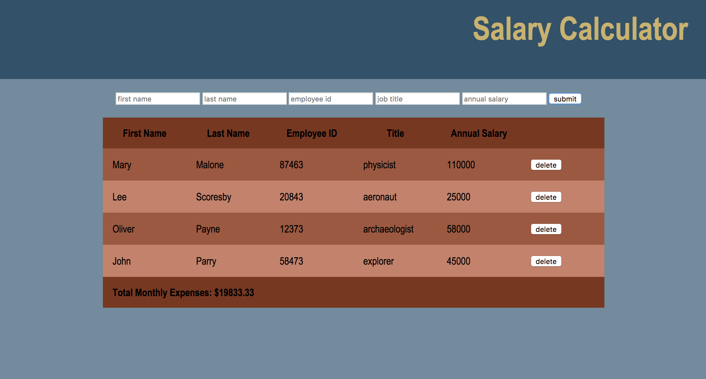

# Employee Salary Calculator

Keeps track of employee salaries and ensures they do not exceed $20,000/month.

## Built With

- JavaScript
- jQuery
- HTML
- CSS

## Screen Shot

### Completed Features

- [x] Add employees
- [x] Delete employees
- [x] Calculate monthly expenses based on employees' salaries
- [x] Display monthly expenses in red if they exceed $20,000